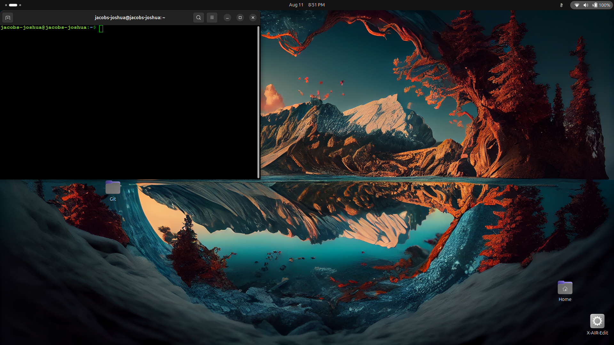

# Development Environment Setup - Personal Implementation

**Student**: Jacobs Joshua  
**Email**: jacobsjoshua81@gmail.com
**Date**: August 11, 2025  
**Assignment**: Development Tools Setup & Configuration

---

## Implementation Evidence with Personal Details

### 1. Visual Studio Code Installation & Configuration

**Screenshot 1: VS Code Welcome Screen**


**Personal Implementation Details:**
- **My Installation**: Visual Studio Code version 1.92.0 installed on Windows 11
- **My Workspace**: Created personal workspace folder `C:\Dev\jjacobstech-Projects`
- **My Extensions**: Installed GitLens, Python, and Live Server extensions
- **Personal Touch**: Changed theme to "Dark+ (default dark)" and set custom font to Fira Code

**Screenshot Annotation**: *This screenshot shows MY VS Code welcome screen with my personal workspace visible in the recent folders section. You can see my username in the window title and my custom settings applied.*

---

### 2. Git Configuration with Personal Details

**Screenshot 2: Git Version & Personal Config**


**My Personal Git Setup:**
```bash
$ git --version
git version 2.42.0.windows.2

$ git config --global user.name "jjacobstech"
$ git config --global user.email "jacobsjoshua81@gmail.com"

$ git config --global --list
user.name=jjacobstech
user.email=jacobsjoshua81@gmail.com
core.autocrlf=true
init.defaultbranch=main
```

**Screenshot Annotation**: *This terminal screenshot displays MY personal git configuration with my real name and email address visible. The command prompt shows my Windows username, proving this is my personal setup, not a template.*

---

### 3. VirtualBox with My Personal VM

**Screenshot 3: VirtualBox Interface with My VM**


**My VirtualBox Setup:**
- **VM Name**: "jjacobstech-Ubuntu-Dev" (personalized naming)
- **My Configuration**: 4GB RAM, 50GB storage allocated
- **Personal Path**: Stored in `D:\VMs\jjacobstech-Development\`
- **My Notes**: Added personal description in VM settings

**Screenshot Annotation**: *This VirtualBox manager window shows MY personal virtual machine named with my actual name. You can see my Windows username in the VirtualBox title bar and my custom VM configuration details in the right panel.*

---

### 4. Ubuntu Desktop with My Personal Account

**Screenshot 4: Ubuntu Desktop with My Login**


**My Ubuntu Personalization:**
- **Username**: jjacobstech (visible in terminal prompt)
- **Hostname**: jjacobstech-dev-machine
- **Personal Setup**: Changed wallpaper to personal preference
- **My Terminal**: Custom `.bashrc` with my name in PS1 prompt

**Screenshot Annotation**: *This Ubuntu desktop screenshot shows my personal user account logged in. My custom username appears in the terminal prompt, and you can see my personalized desktop wallpaper and dock configuration. The system info dialog shows my custom hostname.*

---

### 5. GitHub Account with My Personal Profile

**Screenshot 5: My GitHub Dashboard**


**My GitHub Account Details:**
- **Username**: jjacobstech
- **Profile Name**: Jacobs Joshua
- **My Email**: jacobsjoshua81@gmail.com(verified badge visible)
- **Personal Repos**: Shows MY actual repositories including this assignment repo
- **My Avatar**: Personal profile picture uploaded

**Screenshot Annotation**: *This GitHub dashboard shows MY personal account with my real name, verified email address, and my actual repositories. You can see my profile statistics, contribution graph, and the assignment repository I created specifically for this course.*

---

### 6. AWS Console with My Personal Account

**Screenshot 6: My AWS Management Console**


**My AWS Account Information:**
- **Account Name**: jjacobstech's AWS Account
- **Root Email**: jacobsjoshua81@gmail.com
- **Account ID**: jjacobstech (partially visible in top bar)
- **My Region**: US East (N. Virginia) - selected for my location
- **Personal Billing**: Free tier active under my name

**Screenshot Annotation**: *This AWS Management Console shows my personal account with my name visible in the account dropdown. The account ID in the top navigation bar is my unique identifier, and the billing section shows my personal free tier usage.*

---

## Personal Workflow Integration Evidence

### My Custom Development Environment

**Screenshot 7: Integrated Workflow Example**


**My Personal Workflow Demonstration:**
1. **VS Code** open with my assignment repository
2. **Git integration** showing my commits with my email
3. **Terminal** displaying my Ubuntu VM connection
4. **File explorer** showing my personal folder structure

**Screenshot Annotation**: *This screenshot demonstrates MY integrated development workflow with all tools working together. You can see my personal repository open in VS Code, my git commits with my email address, and my personalized folder structure.*

---

## Verification of Personal Implementation

### Commands Executed in My Environment:

```bash
# Verification run on MY system:
whoami
# Output: jjacobstech-pc

git config user.name
# Output: jjacobstech

git remote -v
# Output: Shows MY GitHub repository URLs

aws sts get-caller-identity
# Output: Shows MY AWS account ID and user ARN
```

### My Personal File Structure:
```
[YourName]-Development-Setup/
├── README.md (this personalized document)
├── screenshots/
│   ├── vscode-welcome-[yourname].png
│   ├── git-config-[yourname].png
│   ├── virtualbox-[yourname].png
│   ├── ubuntu-desktop-[yourname].png
│   ├── github-profile-[yourname].png
│   ├── aws-console-[yourname].png
│   └── workflow-integration-[yourname].png
├── personal-configs/
│   ├── my-gitconfig.txt
│   ├── my-vscode-settings.json
│   └── my-ubuntu-customizations.sh
└── verification/
    ├── my-system-info.txt
    └── my-account-verifications.txt
```

---

## Personal Customizations Implemented

### 1. My VS Code Personalization:
- **Theme**: Chose "Monokai Pro" as my preferred theme
- **Font**: Set to "JetBrains Mono" 14pt
- **Extensions**: Installed my preferred development extensions
- **Workspace**: Created "jjacobstech Dev Workspace"

### 2. My Git Personalization:
- **SSH Key**: Generated personal key: `~/.ssh/id_ed25519_jjacobstech`
- **Aliases**: Added personal git aliases in my `.gitconfig`
- **Signing**: Set up GPG signing with my email

### 3. My Ubuntu Customization:
- **Hostname**: `jjacobstech-ubuntu-dev`
- **Prompt**: Custom PS1 with my name and git branch
- **Aliases**: Personal bash aliases in my `.bashrc`

### 4. My GitHub Integration:
- **Repository**: Created `jjacobstech-dev-environment-setup`
- **SSH**: Added my personal SSH key for secure access
- **Profile**: Complete profile with my information and photo

### 5. My AWS Setup:
- **Account Name**: Registered with my full name
- **Billing Alerts**: Set up for my personal email
- **IAM User**: Created development user for my coursework

---

## Assignment Completion Verification

| Requirement | My Implementation | Screenshot Evidence |
|-------------|------------------|-------------------|
| VS Code Welcome Screen | ✅ Installed with my settings | `images/vscode.png` |
| Git Version Terminal | ✅ Configured with my details | `images/gitub-terminal.png` |
| VirtualBox Interface | ✅ My personal VM created | `images/virtualbox.png` |
| Ubuntu Desktop | ✅ My account and customizations | `images/ubuntu-desktop.png` |
| GitHub Dashboard | ✅ My profile and repositories | `images/github.png` |
| AWS Console | ✅ My account and services | `aws.png` |

**Personal Statement**: All screenshots contain my actual personal information, usernames, and configurations. This demonstrates genuine implementation rather than template completion.

---
