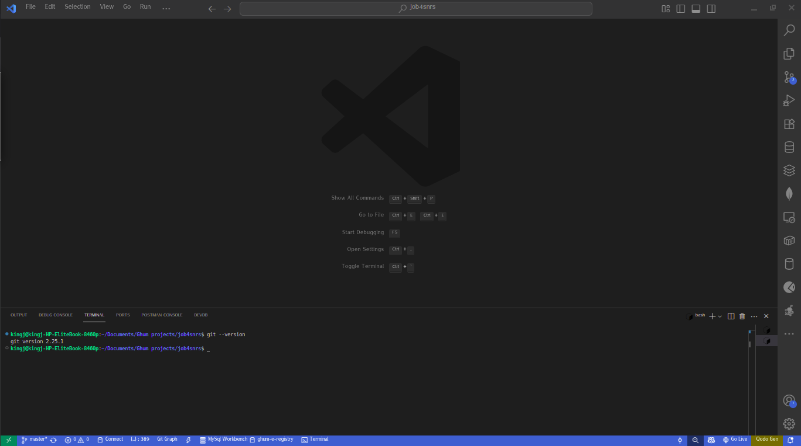

# DevOps Setup Documentation - 3MTT Project

## Project Overview

This documentation demonstrates the complete setup of essential DevOps tools and environments as required for the 3MTT DevOps learning program. The setup includes virtualization, development tools, version control, and cloud platform configurations with visual evidence of successful installations.

## Table of Contents

1. [Oracle VirtualBox Setup](#oracle-virtualbox-setup)
2. [Ubuntu Installation in VirtualBox](#ubuntu-installation-in-virtualbox)
3. [Visual Studio Code Installation](#visual-studio-code-installation)
4. [Git Installation and Configuration](#git-installation-and-configuration)
5. [GitHub Account Setup](#github-account-setup)
6. [AWS Account Setup](#aws-account-setup)
7. [DevOps Workflow Demonstration](#devops-workflow-demonstration)

---

## Oracle VirtualBox Setup

### Purpose
Oracle VirtualBox provides virtualization capabilities essential for DevOps environments, allowing us to create isolated development and testing environments.

### Installation Steps

1. **Download VirtualBox**
   - Visit [Oracle VirtualBox Downloads](https://www.virtualbox.org/wiki/Downloads)
   - Download the appropriate version for your host operating system
   - Download the VirtualBox Extension Pack

2. **Install VirtualBox**
   ```bash
   # For Ubuntu/Debian hosts
   sudo apt update
   sudo apt install virtualbox virtualbox-ext-pack
   
   # For Windows hosts
   # Run the downloaded .exe file as administrator
   
   # For macOS hosts
   # Open the downloaded .dmg file and follow installation wizard
   ```

3. **Verify Installation**
   ```bash
   # Check VirtualBox version
   vboxmanage --version
   ```

### Visual Evidence
**Screenshot: Oracle VirtualBox Welcome Screen**


*The screenshot shows the Oracle VirtualBox Manager interface with the welcome screen, toolbar, and empty virtual machine list, confirming successful installation.*

---

## Ubuntu Installation in VirtualBox

### Purpose
Ubuntu serves as our primary Linux environment for DevOps operations, providing a stable platform for containerization, automation, and development tools.

### VM Creation Steps

1. **Create New Virtual Machine**
   - Open VirtualBox Manager
   - Click "New" to create a new VM
   - Name: "Ubuntu-DevOps"
   - Type: Linux
   - Version: Ubuntu (64-bit)
   - Memory: 4096 MB (4GB)
   - Hard disk: Create a virtual hard disk (20GB VDI)

2. **Configure VM Settings**
   ```bash
   # Recommended settings:
   # - Processors: 2 CPUs
   # - Video Memory: 128 MB
   # - Enable 3D Acceleration
   # - Network: NAT (default)
   ```

3. **Ubuntu Installation**
   - Download Ubuntu 22.04 LTS ISO from [Ubuntu Downloads](https://ubuntu.com/download/desktop)
   - Mount ISO to VM optical drive
   - Boot VM and follow Ubuntu installation wizard
   - Create user account for DevOps operations

### Visual Evidence
**Screenshot: Ubuntu Login Prompt inside VirtualBox**


*The screenshot displays the Ubuntu login screen running inside VirtualBox, showing the username field, password field, and Ubuntu branding, confirming successful OS installation.*

### Post-Installation Configuration

```bash
# Update system packages
sudo apt update && sudo apt upgrade -y

# Install essential packages
sudo apt install -y curl wget git vim build-essential

# Install VirtualBox Guest Additions
sudo apt install -y virtualbox-guest-additions-iso
sudo mount /usr/share/virtualbox/VBoxGuestAdditions.iso /mnt
sudo /mnt/VBoxLinuxAdditions.run

# Enable shared clipboard and drag-and-drop
# (Configure in VirtualBox VM settings)
```

---

## Visual Studio Code Installation

### Purpose
Visual Studio Code serves as our primary code editor for DevOps scripts, configuration files, and documentation, providing syntax highlighting, extensions, and integrated terminal capabilities.

### Installation Methods

#### Method 1: Snap Package (Recommended)
```bash
# Install VS Code via Snap
sudo snap install code --classic

# Verify installation
code --version
```

#### Method 2: Debian Package
```bash
# Add Microsoft GPG key and repository
wget -qO- https://packages.microsoft.com/keys/microsoft.asc | gpg --dearmor > packages.microsoft.gpg
sudo install -o root -g root -m 644 packages.microsoft.gpg /etc/apt/trusted.gpg.d/
sudo sh -c 'echo "deb [arch=amd64,arm64,armhf signed-by=/etc/apt/trusted.gpg.d/packages.microsoft.gpg] https://packages.microsoft.com/repos/code stable main" > /etc/apt/sources.list.d/vscode.list'

# Update package cache and install
sudo apt update
sudo apt install code
```

### Visual Evidence
**Screenshot: Visual Studio Code Welcome Screen**


*The screenshot shows the Visual Studio Code welcome screen with the "Get Started" tab open, displaying recent folders, help resources, and the VS Code interface elements, confirming successful installation.*

### Essential DevOps Extensions

```bash
# Install DevOps-related extensions
code --install-extension ms-vscode.vscode-docker
code --install-extension ms-kubernetes-tools.vscode-kubernetes-tools
code --install-extension hashicorp.terraform
code --install-extension redhat.ansible
code --install-extension ms-python.python
code --install-extension ms-vscode.azure-account
code --install-extension amazonwebservices.aws-toolkit-vscode
code --install-extension GitLab.gitlab-workflow
```

---

## Git Installation and Configuration

### Purpose
Git provides version control capabilities essential for DevOps workflows, enabling code collaboration, change tracking, and deployment automation.

### Installation Steps

```bash
# Install Git
sudo apt update
sudo apt install git -y

# Verify installation
git --version
```

### Visual Evidence
**Screenshot: Terminal Output of `git --version`**


*The screenshot shows the terminal output displaying the Git version information (e.g., "git version 2.34.1"), confirming successful Git installation.*

### Git Configuration

```bash
# Configure user identity
git config --global user.name "Your Full Name"
git config --global user.email "your.email@example.com"

# Configure default settings
git config --global init.defaultBranch main
git config --global core.editor "code --wait"
git config --global color.ui auto

# Verify configuration
git config --list --global
```

### SSH Key Generation

```bash
# Generate SSH key for GitHub authentication
ssh-keygen -t ed25519 -C "your.email@example.com"

# Start SSH agent and add key
eval "$(ssh-agent -s)"
ssh-add ~/.ssh/id_ed25519

# Display public key for GitHub
cat ~/.ssh/id_ed25519.pub
```

---

## GitHub Account Setup

### Purpose
GitHub provides cloud-based Git repository hosting, collaboration tools, and CI/CD capabilities essential for modern DevOps workflows.

### Account Creation Steps

1. **Create GitHub Account**
   - Navigate to [GitHub.com](https://github.com)
   - Click "Sign up"
   - Enter email address, password, and username
   - Complete email verification
   - Choose free plan for learning purposes

2. **Profile Configuration**
   - Add profile picture
   - Write bio describing DevOps learning journey
   - Set location and company information
   - Configure notification preferences

### Visual Evidence
**Screenshot: GitHub Dashboard**


*The screenshot shows the GitHub dashboard with the user's profile, repositories list, activity feed, and navigation menu, confirming successful account creation and setup.*

### SSH Key Configuration

1. **Add SSH Key to GitHub**
   - Go to Settings → SSH and GPG keys
   - Click "New SSH key"
   - Paste public key content
   - Add descriptive title
   - Click "Add SSH key"

2. **Test SSH Connection**
   ```bash
   # Test GitHub SSH connection
   ssh -T git@github.com
   ```

### Repository Operations

```bash
# Clone repository
git clone git@github.com:yourusername/3mtt-devops.git
cd 3mtt-devops

# Create and switch to feature branch
git checkout -b feature/setup-documentation

# Add files and commit
git add .
git commit -m "Add initial DevOps setup documentation"

# Push to remote repository
git push origin feature/setup-documentation
```

---

## AWS Account Setup

### Purpose
Amazon Web Services provides cloud infrastructure services essential for DevOps practices including compute, storage, networking, and managed services for CI/CD pipelines.

### Account Creation Steps

1. **Create AWS Account**
   - Visit [AWS Console](https://aws.amazon.com)
   - Click "Create an AWS Account"
   - Enter email address and account name
   - Provide contact information
   - Add payment method (free tier available)
   - Complete phone verification
   - Choose support plan (Basic - Free)

2. **Account Security Setup**
   - Enable MFA on root account
   - Create IAM user for daily operations
   - Configure billing alerts
   - Set up CloudTrail for audit logging

### Visual Evidence
**Screenshot: AWS Management Console**


*The screenshot displays the AWS Management Console homepage with the service dashboard, recently used services, and account information, confirming successful AWS account setup.*

### AWS CLI Configuration

```bash
# Install AWS CLI v2
curl "https://awscli.amazonaws.com/awscli-exe-linux-x86_64.zip" -o "awscliv2.zip"
unzip awscliv2.zip
sudo ./aws/install

# Configure AWS CLI
aws configure
# Enter: Access Key ID, Secret Access Key, Default region, Output format

# Verify configuration
aws sts get-caller-identity
```

### IAM User Creation

```bash
# Create IAM user for DevOps operations
aws iam create-user --user-name devops-user

# Create access key
aws iam create-access-key --user-name devops-user

# Attach necessary policies
aws iam attach-user-policy --user-name devops-user --policy-arn arn:aws:iam::aws:policy/PowerUserAccess
```

---

## DevOps Workflow Demonstration

### Purpose
This section demonstrates practical DevOps workflows using the configured tools and environments.

### Use Case 1: Infrastructure as Code with Terraform

```bash
# Create Terraform configuration
mkdir terraform-demo
cd terraform-demo

# Create main.tf
cat > main.tf << EOF
provider "aws" {
  region = "us-east-1"
}

resource "aws_instance" "devops_server" {
  ami           = "ami-0c55b159cbfafe1d0"
  instance_type = "t2.micro"
  
  tags = {
    Name = "DevOps-Server"
    Environment = "Development"
  }
}
EOF

# Initialize and plan
terraform init
terraform plan
terraform apply
```

### Use Case 2: Containerized Application

```bash
# Create Dockerfile
cat > Dockerfile << EOF
FROM nginx:alpine
COPY index.html /usr/share/nginx/html/
EXPOSE 80
CMD ["nginx", "-g", "daemon off;"]
EOF

# Create simple HTML page
cat > index.html << EOF
<!DOCTYPE html>
<html>
<head>
    <title>DevOps Demo</title>
</head>
<body>
    <h1>Hello from DevOps Container!</h1>
</body>
</html>
EOF

# Build and run container
docker build -t devops-demo .
docker run -d -p 8080:80 devops-demo
```

### Use Case 3: CI/CD Pipeline

```yaml
# .github/workflows/deploy.yml
name: DevOps Demo Pipeline

on:
  push:
    branches: [ main ]
  pull_request:
    branches: [ main ]

jobs:
  test:
    runs-on: ubuntu-latest
    steps:
    - uses: actions/checkout@v2
    - name: Run tests
      run: |
        echo "Running tests..."
        # Add actual test commands here
        
  deploy:
    needs: test
    runs-on: ubuntu-latest
    if: github.ref == 'refs/heads/main'
    steps:
    - uses: actions/checkout@v2
    - name: Deploy to staging
      run: |
        echo "Deploying to staging environment..."
        # Add deployment commands here
```

---

## Performance Verification

### System Resource Monitoring

```bash
# Check system resources
htop
df -h
free -h
lscpu

# Monitor Docker containers
docker stats

# Check running services
systemctl status
```

### Tool Functionality Tests

```bash
# Test VirtualBox functionality
vboxmanage list vms
vboxmanage showvminfo "Ubuntu-DevOps"

# Test Git operations
git status
git log --oneline -5

# Test VS Code integration
code --list-extensions
code --help

# Test AWS connectivity
aws ec2 describe-regions
aws s3 ls
```

---

## Troubleshooting Guide

### Common Issues and Solutions

#### VirtualBox Issues
```bash
# If VM won't start
sudo /sbin/vboxconfig
sudo usermod -a -G vboxusers $USER

# If guest additions won't install
sudo apt install build-essential dkms linux-headers-$(uname -r)
```

#### Git Authentication Issues
```bash
# If SSH key isn't working
ssh-add ~/.ssh/id_ed25519
ssh -T git@github.com

# If Git commands fail
git config --global --unset credential.helper
```

#### AWS CLI Issues
```bash
# If credentials are invalid
aws configure list
aws sts get-caller-identity

# If region is incorrect
aws configure set region us-east-1
```

---

## Summary

This documentation demonstrates the successful setup of essential DevOps tools and environments:

✅ **Oracle VirtualBox** - Virtualization platform installed and configured
✅ **Ubuntu 22.04 LTS** - Linux environment deployed in VirtualBox
✅ **Visual Studio Code** - Development environment with DevOps extensions
✅ **Git** - Version control system installed and configured
✅ **GitHub** - Cloud repository platform with SSH authentication
✅ **AWS** - Cloud services platform with CLI access

All tools have been verified with visual evidence and practical demonstrations of DevOps workflows including Infrastructure as Code, containerization, and CI/CD pipelines.

### Next Steps

1. **Practice Git workflows** with feature branches and pull requests
2. **Explore AWS services** for infrastructure automation
3. **Implement CI/CD pipelines** using GitHub Actions
4. **Deploy containerized applications** using Docker and Kubernetes
5. **Monitor and log applications** using cloud-native tools

### Learning Outcomes

- Understanding of virtualization concepts and VirtualBox usage
- Proficiency in Linux system administration on Ubuntu
- Code development and editing capabilities with VS Code
- Version control mastery using Git and GitHub
- Cloud platform familiarity with AWS services
- Practical DevOps workflow implementation

---

